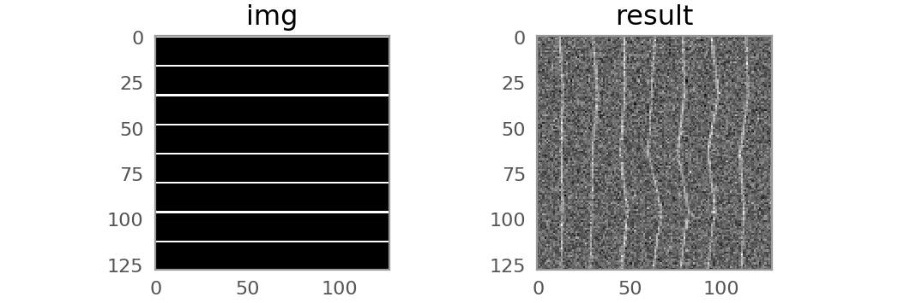
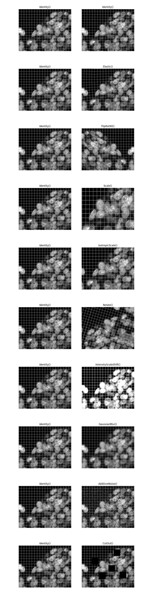

# Augme*nd*

Augmentation library tailored towards the needs of microscopy images analysis. 

*Augmend*  

* provides a simple yet flexible augmentation pipeline without too many bells and whistles 
* supports 2D and 3D images
* operates on numpy arrays and can interface with keras/tensorflow generators  
* offers optional GPU acceleration for compute intensive augmentions via OpenCL     


*Please note that this project is still experimental and the API might change anytime.*


<!---  --->

Currently implemented:

* flips and 90 degree rotations
* scaling, elastic deformation 
* Gaussian noise, Intensity Shifts 

## Installation

`pip install git+https://github.com/stardist/augmend.git`

## Usage

### Basic augmentation pipeline (single images)

First instantiate an augmentation pipeline class and then populate it with augmentation transforms (e.g. fliprotations, elastic transforms, etc). 

```python
from augmend import Augmend           
from augmend import Elastic, FlipRot90, AdditiveNoise

# define augmentation pipeline
aug = Augmend()

# define transforms
aug.add(FlipRot90(axis = (0,1)), probability=1)
aug.add(Elastic(axis = (0,1)),probability=1)
aug.add(AdditiveNoise(sigma = 0.3),probability=1)
#...

```

Afterwards, it can be applied to an image `img` by simply calling `aug(img)`

```python 
import numpy as np 
import matplotlib.pyplot as plt 

# input
img = np.zeros((128, 128), np.float32)
img[::16] = 1 

# output
result = aug(img)


plt.subplot(121);plt.title("img");plt.imshow(img)
plt.subplot(122);plt.title("result");plt.imshow(result)

```


### Simultanously transforming several images

Often, one is given several input images `[X,Y,...]` that need to be transformed the same way e.g. image/label pairs for supervised learning). 
To that end, `Augmend.add` accepts a list of transforms, which then will be applied to each image in the input with the same random seed.

```python 
aug.add([FlipRot90(),FlipRot90()], probability=1)

[X2,Y2] = aug([X,Y])

```

### Augmenting in 3D

Should work the same way - in fact, almost all augmentations should accept nD arrays. The axis over which the transformation is applied can be typically set via the `axis` parameter in the transform object, e.g. `FlipRot90(axis = (0,1,2))`.

Example:


```python
import numpy as np
from augmend import Augmend, Elastic, FlipRot90

# define augmentation pipeline
aug = Augmend()
aug.add([FlipRot90(axis=(0, 1, 2)),
         FlipRot90(axis=(0, 1, 2))],
        probability=0.9)

aug.add([Elastic(axis=(0, 1, 2), amount=5, order=1),
         Elastic(axis=(0, 1, 2), amount=5, order=0)],
        probability=0.9)

# example 3d image and label
x = np.zeros((100,) * 3, np.float32)
x[-20:, :20, :20] = 1.
x[30:40, -10:] = .8
Xs = np.meshgrid(*((np.arange(0, 100),) * 3), indexing="ij")
R = np.sqrt(np.sum([(X - c) ** 2 for X, c in zip(Xs, (70, 60, 50))], axis=0))
x[R < 20] = 1.4
y = np.zeros((100,) * 3, np.uint16)
y[R < 20] = 200

# resulting volume
res = aug([x, y])
```

Should result in a similar output like this (From left to right: original and 4 augmented volumes. Top and bottom, image `x` and labels `y`).


### Usage with a data generator 

In a supervised learning setting, one often constructs a data generator  that yeilds batches of array pairs 

```
# a simple data generator (might as well return several arrays, as for a supervised data generator) 
def data_gen():
    for i in range(4):
        yield x_batch, y_batch
```

`Augmend.flow` allows to wrap that generator into the augmented one, like so

```
aug = Augmend()

aug.add([FlipRot90(axis=(1, 2)),
         FlipRot90(axis=(1, 2))],
        probability=0.9)

aug_gen = aug.flow(data_gen)

# get the results as tuple
res = next(aug_gen)
```
### Usage with `tensorflow` data pipelines

`Augmend.tf_map` returns a `tensorflow` function that can be applied to an existing `tf.data` pipeline via `dataset.map()`: 

```
import numpy as np
import tensorflow as tf
from augmend import Augmend
from augmend.utils import create_test_pattern

y = create_test_pattern(n_samples=16, shape=(512,512), grid_w=(3,10)).astype(np.int16)
x = (y + 50*np.random.normal(0,1,y.shape)).astype(np.float32)

aug = Augmend()
aug.add([Elastic(axis=(0, 1), amount=5, order=1),
         Elastic(axis=(0, 1), amount=5, order=0)])
    
dataset = tf.data.Dataset.from_tensor_slices((x,y))

dataset = dataset.map(aug.tf_map, num_parallel_calls=tf.data.AUTOTUNE)

x2, y2 = next(iter(dataset))

```

### Usage with pytorch Dataset

`Augmend.torch_wrap` will wrap an existing `torch` dataset:  

```
from torch.utils.data import TensorDataset

data = TensorDataset(torch.tensor(x),torch.tensor(y))

data = aug.torch_wrap(data)

x2, y2 = data[0]

```

### Transforming arrays on the GPU

Some transforms (e.g. `Elastic` and `Scale`) allow to use the GPU for the transformation (which can be a bottleneck) via the keyword `use_gpu`. This requires additionally the installation of [`gputools`](https://github.com/maweigert/gputools)


### Available augmentations 




